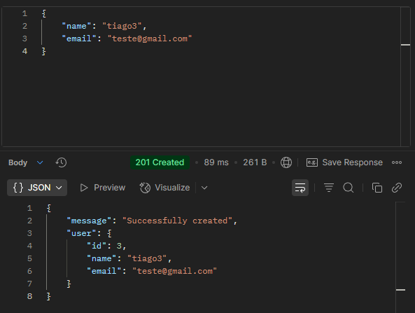
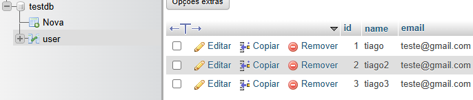

# CRUD_JAVA

Uma API RESTful para gerenciamento de usuários, construída com Spring Boot e Spring Data JPA. Permite realizar operações CRUD (Create, Read, Update, Delete) em um banco de dados MySQL.

```bash
Java 11
Spring Boot 2.7
Spring Data JPA
MySQL
Hibernate
```

## Funcionalidades

- Criação de usuários
- Consulta de usuários
- Atualização de informações de usuários
- Exclusão de usuários

### Exemplo de requisição POST com Postman


### Exemplo de registro no banco de dados com phpMyAdmin
